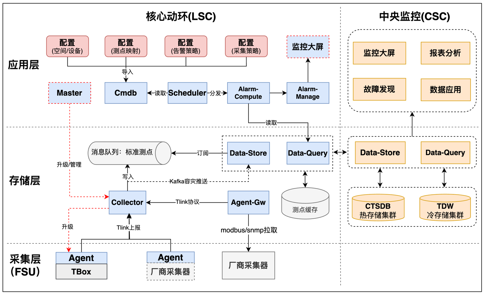

# T-Block-Operation-System (TBOS)

## 系统简介

TBOS是腾讯自研的机房动环监控系统，采用微服务架构设计，包含边缘采集、数据处理、告警计算、配置管理等多个核心模块，支持大规模机房的统一监控管理。

### 适用场景

- **数据中心动环监控**：电力系统、空调系统、环境监测
- **工业设备采集**：支持 Modbus RTU/TCP、SNMP 等工业协议
- **分布式边缘采集**：边缘-云端协同架构，支持离线缓存
- **实时告警管理**：毫秒级告警响应，支持复杂策略表达式

---

## 核心特性

| 特性 | 说明 |
|------|------|
| 🔌 **多协议采集** | 支持 Modbus RTU/TCP、SNMP、DIO 等多种工业协议，可扩展驱动插件 |
| ⚡ **实时告警** | 毫秒级告警响应，支持实时告警(1秒)、延时告警(3秒)、虚拟测点告警(2秒) |
| 🎯 **TNQL表达式引擎** | 支持复杂逻辑、比较、算术运算，内置 DelayEQ/Rise/Fall/InRange 等函数 |
| 🔄 **分布式架构** | 支持水平扩展，高可用部署，主备 Kafka 双活自动切换 |
| 📊 **标准化测点** | 统一的测点体系，支持虚拟测点计算和表达式求值 |
| 📡 **WebSocket推送** | 实时告警推送，无需轮询，前端自动重连 |
| 🌐 **边云协同** | 边缘采集器与云端服务协同工作，支持配置本地缓存兜底 |
| ⚖️ **智能调度** | 基于计算复杂度的负载均衡任务调度，增量下发减少开销 |
| 🔥 **配置热更新** | 支持运行时动态更新采集配置和告警策略，无需重启服务 |

---

## 系统架构

### 整体架构图

### 数据流简图

```
                          ┌──────────────────────────────────────────────────────────────┐
                          │                      配置流                                   │
                          │  Web → CGI → CMDB → MySQL ← Scheduler                        │
                          │                              ↓                               │
                          │              ┌───────────────┼───────────────┐               │
                          │              ↓               ↓               ↓               │
                          │          Agent-GW      Data-Compute    Alarm-Compute         │
                          └──────────────────────────────────────────────────────────────┘
                          
                          ┌──────────────────────────────────────────────────────────────┐
                          │                      数据流                                   │
                          │  物理设备 → Agent → Collector → Kafka → Data-Cache/Store      │
                          │                                 ↑           ↓                │
                          │        Data-Compute (读取Data-Cache计算)   Data-Query         │
                          └──────────────────────────────────────────────────────────────┘
                          
                          ┌──────────────────────────────────────────────────────────────┐
                          │                      告警流                                   │
                          │  Alarm-Compute (读取Query) → Kafka(告警+日志)                  │
                          │                                    ↓                         │
                          │                        ┌───────────┴───────────┐             │
                          │                        ↓                       ↓             │
                          │               Alarm-Manage(入库)        Alarm-Server(生效率)  │
                          └──────────────────────────────────────────────────────────────┘
```

---

## 技术栈

| 类别 | 技术 |
|------|------|
| **后端语言** | Go 1.18+ |
| **RPC框架** | etrpc-go (基于 trpc-go 的增强框架) |
| **前端框架** | Vue 3 + TypeScript |
| **消息队列** | Kafka (支持主备双活) |
| **时序数据库** | InfluxDB 1.8+ |
| **关系数据库** | MySQL 5.7+ |
| **缓存** | Redis 6.0+ |
| **容器化** | Docker |

---

## 模块说明

### 核心服务模块

| 模块 | 端口 | 说明 | 主要能力 |
|------|------|------|----------|
| [etrpc-go](./etrpc-go) | - | 基础RPC框架 | 配置加载/热更新、数据库客户端封装、日志增强、指标上报、HTTP响应包装 |
| [agent](./agent) | 61000 | 边缘采集器/云端网关 | Modbus/SNMP/DIO多协议采集、虚拟测点计算、标准测点映射、配置热更新。Agent和Agent-GW是同一套代码，通过配置决定任务获取方式 |
| [scheduler](./scheduler) | 8081 | 调度中心 | 监听MySQL配置变化、负载均衡任务分配、增量下发、Agent-GW/Data-Compute/Alarm-Compute任务调度 |
| [alarm-compute](./alarm-compute) | 8082 | 告警计算引擎 | 接收Scheduler调度任务、读取Data-Query获取测点数据、TNQL表达式计算、告警消息写入Kafka、计算日志写入Kafka |
| [alarm-manage](./alarm-manage) | 8083 | 告警管理 | 消费Kafka告警消息、告警去重指纹、雪花ID生成、告警持久化到MySQL |
| [alarm-server](./alarm-server) | 8086 | 告警服务 | 告警查询/统计/趋势、读取Kafka日志计算告警生效率、告警诊断 |
| [cmdb](./cmdb) | 8087 | 配置管理 | 设备/测点/模板/策略配置、配置持久化到MySQL、配置导出ZIP |
| [collector](./collector) | 8088 | 配置收集器 | 读取CMDB配置、本地配置缓存兜底、接收Agent数据、数据转发到Kafka |
| [data-cache](./data-cache) | 8084 | 数据缓存 | 消费Kafka测点数据、循环窗口内存缓存(10分钟)、为Data-Query提供实时数据 |
| [data-compute](./data-compute) | 8089 | 数据计算 | 接收Scheduler调度任务、读取Data-Cache测点数据、标准测点表达式计算、计算结果写入Kafka |
| [data-query](./data-query) | 8090 | 数据查询 | 从Data-Cache读取实时数据、从InfluxDB读取历史数据、为Alarm-Compute提供测点查询 |
| [data-store](./data-store) | 8085 | 数据存储 | 消费Kafka测点数据、数据持久化到InfluxDB |
| [cgi](./cgi) | 8080 | API网关 | HTTP/WebSocket接口、配置导入到CMDB、实时告警推送、对接Web前端 |
| [common](./common) | - | 公共模块 | 实体定义、常量定义、表达式引擎、分布式锁工具 |
| [web](./web) | - | 前端应用 | 监控大屏、管理界面 |


---

## 快速开始

### 环境要求

| 组件 | 版本要求 |
|------|---------|
| Go | 1.18+ |
| Node.js | 16+ |
| Docker & Docker Compose | Latest |
| MySQL | 5.7+ |
| Redis | 6.0+ |
| Kafka | 2.8+ |
| InfluxDB | 1.8+ |

### 最小化部署

#### 硬件要求

| 配置项 | 要求 |
|--------|------|
| CPU | 8核心 |
| 内存 | 32 GB |
| 存储 | 200 GB |

> **备注**：单模组总资源不低于 52核心，资源规划建议 CPU:内存 = 1:4

#### 操作系统

- Ubuntu 16.04/18.04 LTS (64-bit) 以上
- CentOS Linux 7.6 (64-bit) 以上
- Tencent Linux 2.2 以上

### 本地编译运行

```bash
# 1. 克隆项目
git clone <repository_url>
cd tbos

# 2. 编译所有服务
./tbos.sh build

# 3. 初始化数据库
mysql -u root -p < ddl.sql

# 4. 启动所有服务
./tbos.sh start

# 5. 停止所有服务
./tbos.sh stop
```

### Docker 部署

```bash
# 1. 构建所有镜像
./tbos.sh build image

# 2. 启动所有服务
./tbos.sh start image

# 3. 停止所有服务
./tbos.sh stop image
```

### 集群化部署建议

| 部署方式 | 说明 |
|---------|------|
| 分布式部署 | 采购服务器进行分布式部署 |
| 公有云部署 | 腾讯云、AWS、Azure等 |
| 私有云部署 | TKE、KVM、自建K8S集群等 |

---

## 配置说明

### 环境变量配置

编辑 `server.cfg` 文件配置环境变量：

```bash
# 数据库配置
MYSQL_HOST=localhost
MYSQL_PORT=3306
MYSQL_USER=root
MYSQL_PASSWORD=password
MYSQL_DATABASE=tbos
MYSQL_ADDR=${MYSQL_HOST}:${MYSQL_PORT}

# Redis配置
REDIS_HOST=localhost
REDIS_PORT=6379
REDIS_PASSWORD=
REDIS_ADDR=${REDIS_HOST}:${REDIS_PORT}

# Kafka配置
KAFKA_HOST=localhost
KAFKA_PORT=9092
KAFKA_ADDR=${KAFKA_HOST}:${KAFKA_PORT}
KAFKA_POINT_TOPIC=tbos_point_data
KAFKA_ALARM_TOPIC=tbos_alarm_msg

# InfluxDB配置
INFLUXDB_HOST=localhost
INFLUXDB_PORT=8086
INFLUXDB_USER=admin
INFLUXDB_PASSWORD=password
INFLUXDB_DBNAME=tbos
INFLUXDB_ADDR=${INFLUXDB_HOST}:${INFLUXDB_PORT}
INFLUXDB_POINT_MEASUREMENT=points

# 本机IP
LOCAL_IP=127.0.0.1

# 服务端口
PORT_CGI=8080
PORT_SCHEDULER=8081
PORT_ALARM_COMPUTE=8082
PORT_ALARM_MANAGE=8083
PORT_DATA_CACHE=8084
PORT_DATA_STORE=8085
PORT_ALARM_SERVER=8086
PORT_CMDB=8087
PORT_COLLECTOR=8088
PORT_DATA_COMPUTE=8089
PORT_DATA_QUERY=8090
PORT_AGENT=61000
```

### 服务配置文件

每个服务目录下的 `trpc_go.yaml` 为服务配置文件，包含：

| 配置项 | 说明 |
|--------|------|
| `etrpc` | 服务名称、端口配置 |
| `global` | 全局配置（命名空间、本机IP等） |
| `server.service` | 服务监听配置（协议、端口） |
| `client.service` | 客户端配置（数据库、Redis、Kafka、RPC调用） |
| `plugins` | 插件配置（日志、监控等） |

### 服务端口分配

| 服务 | 默认端口 | 协议 |
|------|---------|------|
| CGI | 8080 | HTTP |
| Scheduler | 8081 | HTTP |
| Alarm-Compute | 8082 | HTTP |
| Alarm-Manage | 8083 | HTTP/Kafka |
| Data-Cache | 8084 | HTTP/Kafka |
| Data-Store | 8085 | HTTP/Kafka |
| Alarm-Server | 8086 | HTTP |
| CMDB | 8087 | HTTP |
| Collector | 8088 | HTTP |
| Data-Compute | 8089 | HTTP |
| Data-Query | 8090 | HTTP |
| Agent | 61000 | HTTP |

---

## 数据库说明

### 初始化

使用 `ddl.sql` 初始化数据库：

```bash
mysql -u root -p < ddl.sql
```

### 核心表说明

| 表名 | 说明 |
|------|------|
| `t_alarm_active` | 活动告警表，存储当前未恢复的告警 |
| `t_alarm_history` | 历史告警表，存储已恢复的告警 |
| `t_alarm_strategy` | 告警策略表，包含告警/恢复表达式、级别、内容模板 |
| `t_alarm_worker` | 告警Worker表，用于雪花算法分布式协调 |
| `t_collector_device` | 采集设备表，包含设备GID、通道、模板等 |
| `t_collector_template` | 采集模版表，包含协议类型、版本、设备型号 |
| `t_collector_template_point` | 模版测点表，包含测点定义、协议定义 |
| `t_device_entity` | 设备实体表，包含设备GID、名称、所属模组 |
| `t_device_point` | 设备测点表，包含测点表达式、映射关系 |
| `t_mozu_info` | 模组信息表，包含模组ID、名称、发布版本 |
