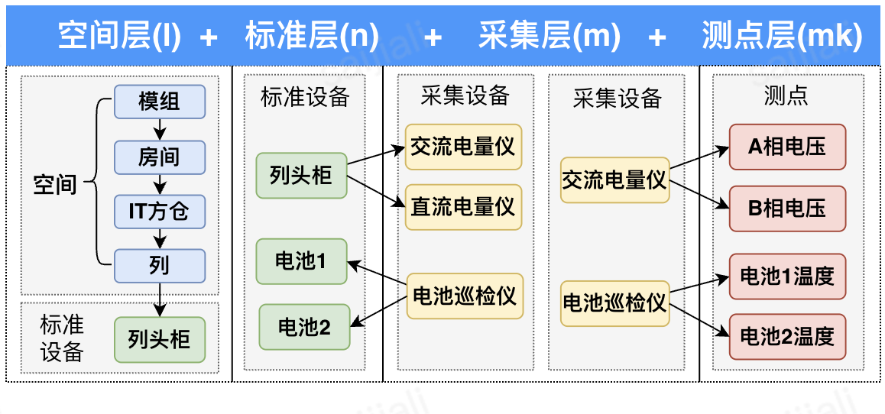

# 核心概念

通常而言，数据中心动环系统的建模层次为4层架构：

- 空间层(I)：模组、房间、IT方仓、列等
- 标准层(n)：标准设备，如列头柜、电池等
- 采集层(m)：采集设备，如交流电量仪、直流电量仪、电池巡检仪等
- 测点层(mk)：测点，如A相电压、B相电压、电池温度等

本文档将对TBOS中涉及到的一些核心概念作进一步的详细介绍：

- **[模组 (Mozu)](./mozu.md)**：设备树中的空间位置节点，对应数据中心的方舱或模块化机房。模组是配置管理、数据隔离和资源规划的最小单元。
- **[设备 (Device)](./device.md)**：TBOS 中一切被管理对象的统一抽象。无论是物理的传感器、空调，还是逻辑的园区、模组，都统一建模为"设备"，通过 **设备树**组织为层级归属关系。
- **[测点 (Point)](./point.md)**：设备上的标准化数据点位，是数据采集、监控、告警和控制的原子载体。从原始采集到衍生计算，测点贯穿整条数据链路。

## 三者关系

- **模组**是空间容器，决定了设备的归属和隔离域。
- **设备**挂载在模组下，承载配置属性和业务身份。
- **测点**挂载在设备上，是数据的实际生产单元，支撑上层的监控、告警、控制等功能。

## 快速导航

| 概念 | 文档 | 核心要点 |
|------|------|----------|
| 模组 | [mozu.md](./mozu.md) | 设备树中的空间节点、`t_mozu_info` 表、配置与告警版本管理 |
| 设备 | [device.md](./device.md) | 统一抽象、设备树 (`t_device_entity` + `ParentDeviceNumber` 自引用)、卫星表存配置属性 |
| 测点 | [point.md](./point.md) | 采集/标准/虚拟/告警四类测点、Agent 采集与计算、Alarm-Compute 表达式求值 |
