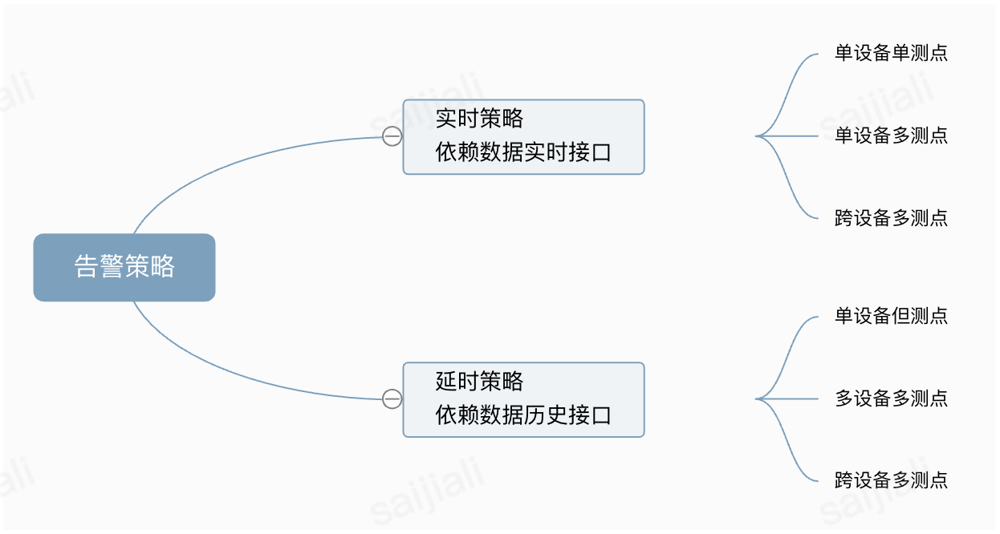

# 告警策略设计

TBOS中的告警策略是一套用于定义和触发设备监控告警的规则体系，是告警计算引擎（Alarm-Compute）执行的核心对象。规定了在何种数据条件下应产生告警，以及告警的级别、内容和恢复条件。

## 类型

按实时性，告警策略可以分为两种：

- **实时策略**：依赖于数据的实时接口
- **延时策略**：依赖于数据的历史接口

根据涉及设备的关系、测点的多少又可以分为

- **单设备单测点**
- **单设备多测点**
- **跨设备多测点**

下表说明了告警模块支持的所有告警策略类型：

| 告警策略类型 | 含义 | 触发时机 | 测点数据来源 |
| ------ | -- | ---- | ------ |
| 单测点实时告警策略 | 实时分析某个测点的数据，通过表达式分析判断该测点的数据是否需要告警 | 实时 | Kafka实时消息流 |
| 多测点实时告警策略 | **同一台设备存在多个测点**，使用实时（伪实时）的方式记录某时刻多个测点的数据，通过表达式分析判断这些测点的数据是否需要告警 | 实时 | 数据模块伪实时数据 |
| 跨设备实时告警策略 | **一条告警策略涉及多个设备**，使用实时（伪实时）的方式记录某时刻多台设备上多个测点的数据，通过表达式分析判断是否需要告警 | 实时 | 数据模块伪实时数据 |
| 延时告警策略 | 对告警的判断依赖于**过去某个时刻**的历史数据 | 延时 | 数据模块历史数据 | 
| 延时告警策略 | 对告警的判断依赖于**过去到现在一段连续时间**的历史数据 | 延时 | 数据模块历史数据 | 
| 延时告警策略 | 对告警的判断依赖于**过去一段时间跳变测点**的历史数据 | 延时 | 数据模块历史数据 |

## Schema

| 字段名 | 作用 |
| ------ | ---- |
| config_id | 实例化config的id |
| rid | 对应配置策略ID |
| rid_type | 策略分类，实时/延时。0: 实时，1: 延时 |
| version | unix时间戳，对应update_time |
| create_at | 创建时间 |
| update_time | config更新时间 |
| update_at | 更新时间 |
| create_by | 创建人 |
| mozu_id | 模组id |
| update_by | 更新人 |
| device_number_list | 告警设备列表（gid_list） |
| rainbow_key | 七彩石key |
| alarm_level | 告警级别（L0 L1 L2 L3 L4） |
| device_type_en | 设备类型 英文 |
| application_type_zh | 中文应用类型 |
| alarm_expression | 告警表达式 |
| application_type_en | 英文应用类型 |
| alarm_expression_str | 原始告警表达式 |
| device_category_zh | 中文设备种类 |
| restore_expression | 恢复表达式 |
| device_category_en | 英文设备种类 |
| restore_expression_str | 原始恢复表达式 |
| advance_conditions | 高级条件，暂未启用 |
| expression_map | 表达式映射 |
| others | 其他条件，暂时为空。备业务拓展 |
| notice_type | 通知方式 |
| alarm_type | 告警类型名，如："中压联络柜综保备自投动作未完成" |
| content_template | 告警内容模版 |
