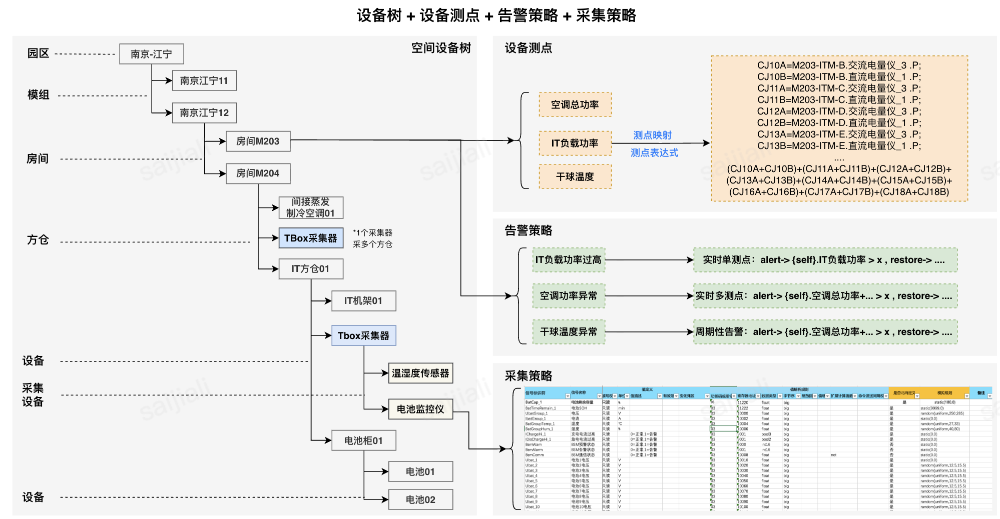

TBOS中的配置模块负责以下功能：

- **统一设备建模**：将空间位置、设备、采集器等统一建模为设备，并通过设备树维护空间关系。
- **配置属性化与版本管理**：将测点、告警策略、采集策略等作为设备属性，支持配置版本控制和变更追溯。
- **配置下发与同步**：支持全量/增量配置下发，版本查已更新，以及从外部配置源同步。
- **为下游服务提供数据**：为Agent采集器、Collector等提供设备配置、采集模版、标准测点等查询和导出服务。

> TBOS 将空间位置、标准设备、采集器、虚拟设备统一抽象为「设备」，通过设备树维护层级关系。详见 [设备](../../concepts/device.md)。

## 配置模块架构图

## 模块概览

配置模块包含以下核心服务：

| 服务 | 文档 | 说明 |
|------|------|------|
| **CMDB** | [cmdb.md](cmdb.md) | 配置管理数据库，负责模组/设备/测点/采集模版的统一建模、配置版本管理、配置下发与查询导出 |

## 配置数据流向

## 服务间关系

- **CMDB → Agent**：提供设备配置、采集模版、标准测点查询，Agent 启动时从 CMDB 拉取配置以确定采集任务
- **CMDB → Collector**：提供采集设备配置和采集模版，Collector 据此进行数据总线调度与协议解析
- **CMDB → Data Compute**：提供虚拟测点和标准测点定义，Data Compute 依此进行表达式计算
- **CMDB → Alarm Compute / Alarm Manage**：提供告警策略配置（阈值、级别、通知规则等），驱动告警判定逻辑
- **CMDB → Scheduler**：提供任务调度相关配置，Scheduler 据此向 Data Compute 下发计算任务
- **CMDB ← CGI（平台模块）**：接收来自 Web 前端的用户配置操作（设备增删改查、模版管理、配置导入导出）
- **CMDB ← 外部配置源**：支持通过 Excel 批量导入配置模型（设备/测点/采集器/模版/策略），实现配置初始化与迁移
