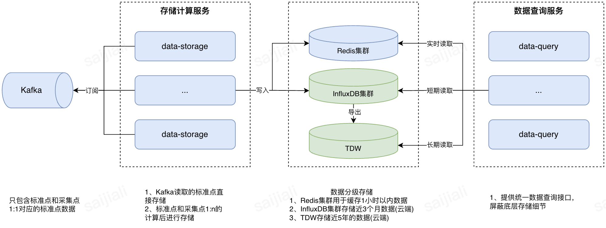

# 数据模块

数据模块是系统的核心支撑层，承担整个系统的数据枢纽职能。

其核心作用包括：

- **数据采集和预处理**：从边缘采集器(Agent、Agent-GW)汇聚数据，并进行初步清洗、格式标准化和虚拟测点计算
- **分级存储**：提供三级存储层次（实时缓存、热存储、冷存储），平衡性能、成本和存储周期
- **提供数据查询接口**：向上层应用（告警计算、Web前端）提供统一的数据查询API

## 系统架构

## 模块概览

数据模块包含以下 4 个核心服务：

| 服务 | 文档 | 说明 |
|------|------|------|
| **Data Store** | [data-store.md](data-store.md) | 数据持久化存储服务，消费 Kafka 测点数据，写入 InfluxDB 等存储后端 |
| **Data Cache** | [data-cache.md](data-cache.md) | 内存缓存层，提供热点测点数据的快速访问与变化检测 |
| **Data Compute** | [data-compute.md](data-compute.md) | 计算引擎，负责虚拟测点/标准点的任务调度与表达式计算 |
| **Data Query** | [data-query.md](data-query.md) | 时序数据查询服务，提供历史数据与变化数据查询能力 |

## 数据流向

## 服务间关系

- **CMDB** 提供设备/测点/模版配置的读写，是配置数据的唯一权威来源
- **Data Store** 消费 Kafka 中的测点数据，通过可插拔存储插件写入 InfluxDB 等后端
- **Data Cache** 作为内存缓存层，提供低延迟的测点数据查询与变化检测
- **Data Query** 提供时序数据的查询能力（历史数据、变化数据）
- **Data Compute** 接收 Scheduler 下发的计算任务，管理虚拟测点的表达式计算
