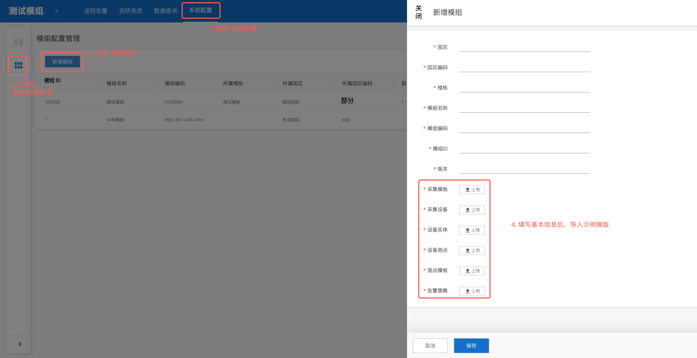

这个模拟数据接入手册用于说明如何使用agent模块进行模拟数据接入。

请注意，实际使用时，agent模块通常内置于腾讯自研的TBOX中，开源TBOS中提供的此功能仅用于调试验证。

## 1. 下载模拟数据模版

测试所用的模拟数据模版存放在仓库 `example_data/` 目录下，包含以下文件：

### TBOS 模版（`assets/example_data/TBOS模版/`）

| 文件 | 说明 |
|------|------|
| `TBOS模版.zip` | 所有模版的整体压缩包（约 50KB），可直接下载导入 |
| `告警策略信息.xlsx` | 模拟告警策略配置，定义触发条件和告警级别 |
| `设备实体信息.xlsx` | 模拟设备的基本信息（设备编号、名称、类型、所属模组等） |
| `设备测点信息.xlsx` | 设备下挂载的测点定义（测点ID、名称、数据类型、单位等） |
| `采集模版信息.xlsx` | 采集模版配置（协议类型、采集周期、超时时间等） |
| `采集模版测点信息.xlsx` | 采集模版中每个测点的映射关系（协议地址 → 平台测点） |
| `采集设备信息.xlsx` | 采集设备与模版的绑定关系 |
| `某模组51门控制器.xlsx` | 门控制器设备的实际示例数据，可作为参考 |

### 使用方式

直接下载 `TBOS模版.zip` ，解压后，在web界面导入TBOS平台



## 2. 配置 Agent 模块

Agent 的模拟数据接入功能通过编辑 `ref/tbos/agent/trpc_go.yaml` 配置文件来启用。

### 2.1 开启模拟模式

确保配置文件中 `feature.simulation` 开关已置为 `1`：

```yaml
feature:
  simulation: 1  # 1=开启模拟数据模式，0=关闭
```

### 2.2 配置目标设备

在 `task.local.devs` 列表中指定需要模拟接入的目标设备编号。将原有设备替换为 `XX-XX-MG01-0122-ITMA-MC-DA01`：

```yaml
task:
  mode: local
  local:
    devs:
      - XX-XX-MG01-0122-ITMA-MC-DA01
```

> **说明**：`task.mode: local` 表示 Agent 运行在本地任务模式，不依赖远程调度器下发任务。`task.local.devs` 是一个设备编号列表，Agent 启动后会尝试接入列表中所有设备的模拟数据。

### 2.3 启动 Agent

配置完成后，进入 `ref/tbos/agent/` 目录启动 Agent：

```bash
cd ref/tbos/agent && go run main.go
```

启动后观察日志输出，确认设备 `XX-XX-MG01-0122-ITMA-MC-DA01` 的模拟数据已正常接入。
